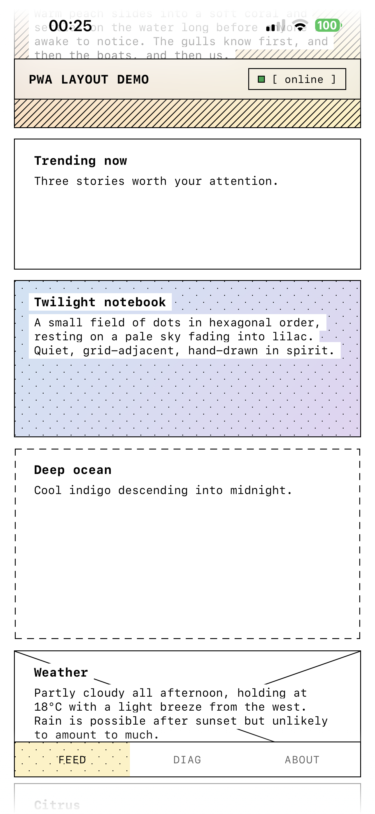

# Demo PWA layout

<p align="center">
  
</p>

A reference implementation of a mobile-first Progressive Web App. The codebase is split into a reusable `src/core/` template that solves the structural problems every installed PWA hits (safe-area insets, viewport height, service-worker updates, version polling) and a demo `src/app/` that shows the core in use. Built with Vite, TypeScript, and native Web Components — no framework runtime.

The goal is to serve as a copy-in starting point for new PWAs and to document the non-obvious iOS/Android behaviors the core works around. See [docs/pwa-layout.md](docs/pwa-layout.md) for the layout invariants and [docs/using-core.md](docs/using-core.md) for the bootstrap guide.

## Features

### Installable PWA manifest

`vite-plugin-pwa` generates the manifest and service worker from `vite.config.ts`. Standalone display, portrait orientation, icon set, and start URL are configured there.

### Safe-area inset stability on reload

A hidden `env()`-probe in `src/core/lib/insets.ts` mirrors computed safe-area paddings into `--sai-top/right/bottom/left` CSS custom properties, persists them in `localStorage` per orientation, and a synchronous inline `<script>` in `index.html` applies the cached values before first paint. This prevents the iOS/Android bug where `env(safe-area-inset-*)` transiently reads 0 after reload.

### Stable viewport height

The same mechanism mirrors `visualViewport.height` into `--app-h`, avoiding the `100dvh` flash on Android Chrome standalone reloads.

### Service worker with update prompt

`src/core/lib/sw-register.ts` wraps `registerSW` from `virtual:pwa-register` and emits `idle` / `update-available` / `offline-ready` states. The demo surfaces these as a top-bar status chip and an update banner; clicking reload coordinates a `controllerchange` handoff before reloading.

### Active version polling

`src/core/lib/version-check.ts` is an async generator that polls `/version.json` (emitted by a Vite plugin at build time) every 30 s and yields when the server version differs from the build's baked-in `__SW_VERSION__`. It pauses on hidden tabs and resumes on `visibilitychange`.

### Reload overlay

A white fullscreen overlay hides the post-reload flash while the service worker activates; it's revealed only when `sw.reload()` is triggered.

### Tabbed shell demo

`src/app/` shows a top bar, bottom-bar tab switcher, and three views (Feed, Diagnostics, About) wired via custom events on `<app-shell>`. The shell itself is inert — routing lives in `src/app/main.ts`.

### Live diagnostics view

`src/app/components/diagnostics-view.ts` renders a snapshot of insets, viewport dimensions, display mode, network/SW state, scroll position, and UA — useful when debugging layout on real devices.

## Development

```bash
npm install
npm run dev       # Vite dev server
npm run build     # tsc + vite build
npm run preview   # serve the built app
npm run test      # vitest
```
